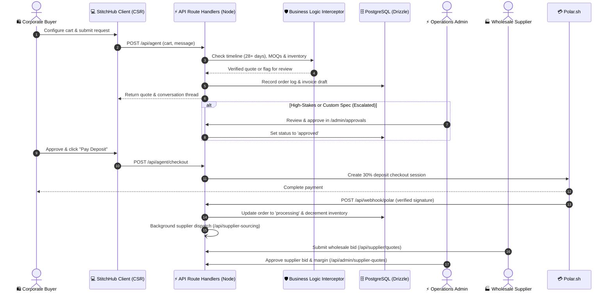

# StitchHub

<p align="center">
  <strong>Custom merchandise sourcing, minus the headache.</strong><br />
  From design to the factory floor — quotes, guardrails, and supplier dispatch in minutes instead of weeks.
</p>

<p align="center">
  
  
  
  
  
  
  
  
</p>

---

<p align="center">
  
</p>

---

## The Problem StitchHub Solves

If you have ever ordered custom company apparel or branded merchandise for a team offsite, you already know the pain:

- **Endless back-and-forth emails** just to find out if an item is in stock.
- **Surprise minimum order quantities (MOQs)** discovered only after you've finalized your design.
- **Opaque pricing tiers** where nobody can give you a straight answer on volume discounts.
- **Disconnected suppliers** leaving you wondering if your boxes will actually show up before event day.

**StitchHub** was built to replace that manual grind with a single, calm command center. It connects buyers, production operations, and manufacturing suppliers on one shared platform—automating quote creation, verifying manufacturing feasibility, and routing jobs directly to factory floors.

---

## How It Works: A Guided Tour

### 1. For Buyers & Brand Teams: Configure Products with Zero Guesswork

Brand teams can browse a curated selection of premium blanks—from heavyweight streetwear hoodies and performance polos to matte tumblers and tech organizer pouches.

- **Real-Time Volume Pricing**: As you adjust quantities, unit prices update immediately based on transparent volume tiers.
- **Customization Techniques Built-In**: Pick from embroidery, screen printing, heat transfers, rubber patches, or woven labels without wondering what a factory supports.
- **Guardrails from the Start**: The cart actively respects minimum order quantities so orders aren't submitted with unrealistic production numbers.

<p align="center">
  
  
</p>

---

### 2. An AI Sourcing Assistant That Actually Understands Manufacturing

Instead of filling out tedious requisition forms, buyers can describe their order naturally:
> *"We need 120 dark navy hoodies with embroidered chest logos and 80 matte tumblers for an offsite in 5 weeks."*

Behind the scenes, StitchHub doesn't just treat this as a generic chatbot conversation:

- **Timeline Reality Checks**: Manufacturing takes time. The system strictly guards a **28-day minimum production window** so customers aren't promised unrealistic delivery dates.
- **Inventory Verification**: Before quotes are drafted, stock levels of raw blanks in the warehouse are checked to prevent overselling.
- **Smart Escalation**: If an order requires complex cut-and-sew work or breaches safe production limits, it pauses smoothly and notifies an operations teammate—keeping the thread active without breaking the user experience.

---

### 3. For Operations: Real Visibility and Effortless Human Takeover

Operations managers get a clear birds-eye view of everything happening across the pipeline:

- **Actionable Dashboard**: Keep an eye on incoming quotes, conversion rates, and urgent orders that need human attention.
- **One-Click Chat Takeover**: Jump straight into any customer's AI conversation to answer custom questions or adjust details on the fly.
- **Margin Analysis**: Review supplier bids side-by-side with client prices. The platform calculates your projected gross profit and unit margins before you approve factory pricing.
- **Stock Control**: Monitor blank garment stock levels and set reorder alert thresholds so popular items never run out.

<p align="center">
  
</p>

<p align="center">
  
  
</p>

---

### 4. For Suppliers: Clean Production Requests, Ready to Fulfill

Wholesale suppliers and embroidery mills get their own streamlined portal—no noisy customer communications, just straightforward production jobs:

- **Structured RFQ Feed**: View incoming requests with garment models, colorways, quantities, and target delivery dates neatly laid out.
- **Fast Bidding**: Suppliers enter their wholesale unit price and estimated turnaround time in days with a single click.
- **Direct Logistics Chat**: Real-time messaging lets suppliers clarify thread colors, fabric weights, or shipping details directly with the StitchHub team.

<p align="center">
  
</p>

---

### 5. Locking It In: 30% Milestone Deposits

Custom manufacturing requires upfront capital commitments from buyers before blank garments are pulled and printed.

- Once a quote is approved, buyers can pay a **30% production deposit** via a secure, clean checkout powered by Polar.
- The moment payment clears, the order automatically moves to **Processing**:
  1. Warehouse inventory is reserved and deducted.
  2. The supplier is issued an official purchase order with an active tracking identifier.
  3. The buyer sees their confirmation screen and can track order status in their dashboard.

<p align="center">
  
  
</p>

---

## Under the Hood: Technical Architecture

All the engineering details for how StitchHub is built and organized.

### Requisition Lifecycle Flow



---

### Technology Stack & Design Decisions

| Layer | Choice | Why We Chose It |
|---|---|---|
| **Framework** | **Next.js 16.2.6** (App Router) | CSR-first model for maximum responsiveness across interactive portals. Root `layout.tsx` is the sole Server Component; all interactive views are `'use client'`. |
| **UI Library** | **React 19.2.4** | Modern component lifecycle utilizing React 19 hooks and async parameter resolution (`use(params)`). |
| **Styling** | **Tailwind CSS v4** + Framer Motion | Bespoke "Luxury Dark" theme with `#09090b` zinc bases, `#d4af37` gold accents, and subtle glassmorphic backdrops (`backdrop-blur`). |
| **Database** | **PostgreSQL (Supabase)** | Cloud Postgres managed via Supabase with transaction connection pooling. |
| **ORM & Migrations** | **Drizzle ORM 0.45** | Type-safe SQL queries across 7 domain tables with explicit Drizzle migrations in `src/db/migrations`. |
| **Authentication** | **Supabase Auth & SSR** | Cookie-based session management, TOTP Two-Factor Authentication (MFA), and session refreshing via Next.js 16 Edge proxy (`src/proxy.ts`). |
| **Authorization** | **Email Allowlist (AoA)** | Runtime allowlist checks (`ADMIN_EMAILS`, `SUPPLIER_EMAILS`) evaluated at the proxy layer and re-verified inside protected route handlers for defense-in-depth. |
| **State Management** | **Zustand 5** | Six targeted client stores (cart, checkout form, product filters, profile, supplier portal, and motion preferences). Cart is persisted to `localStorage`. |
| **Server Cache** | **TanStack Query 5** | Manages server-state synchronization with 60-second stale times and automatic query invalidation on mutations. |
| **AI Runtime** | **Ollama** + **Google Gemini** | Runs a local GGUF model (`stitchhub-v5`) on port 11434 with automatic, resilient failover to Google Gemini (`gemini-2.5-flash`). |
| **Vector Search** | **Pinecone** | Semantic catalog matching with an automatic in-memory cosine ranking fallback. |
| **Payments** | **Polar.sh** | Production milestone deposit checkout with cryptographically verified HMAC webhooks. |
| **Email** | **Brevo** | Transactional customer notifications for quote receipts, approvals, and order dispatches. |
| **Tooling** | **Bun** | Ultra-fast package management, TypeScript execution, and local script workflows. |

---

### Repository Layout

```
Stitchhub-main/
├── docs/                           # Architecture guides & documentation
│   ├── QUICKSTART.md               # Local setup & database seeding instructions
│   ├── SUMMARY.md                  # Comprehensive architectural system reference
│   └── polar-integration.md        # Polar payments & webhook verification guide
├── public/
│   ├── image.webp                  # Hero platform preview
│   └── images/
│       ├── app/                    # WebP operational interface screenshots
│       └── products/               # Wholesale product catalog imagery
├── src/
│   ├── proxy.ts                    # Next.js 16 Edge proxy (session refresh & authz gates)
│   ├── app/                        # App Router (pages & API route handlers)
│   │   ├── layout.tsx              # Root Server Component (providers, nav, cart drawer)
│   │   ├── page.tsx                # Landing funnel
│   │   ├── admin/                  # Operations Command Center (dashboard, orders, quotes, stock)
│   │   ├── api/                    # Node.js route handlers (agent, chat, admin, supplier)
│   │   ├── auth/                   # Login, signup, and MFA challenge views
│   │   ├── payment/success/        # Polar deposit success confirmation
│   │   ├── products/               # B2B catalog directory & product detail pages
│   │   ├── profile/                # Buyer workspace (chat inbox, order history, settings)
│   │   └── supplier/               # Supplier portal (active RFQs, bids, channel messages)
│   ├── components/                 # Reusable UI atoms and composites
│   │   ├── admin/                  # Admin UI components (GlassCard, StatusBadge)
│   │   ├── agentic-ai-inbox/       # Multi-turn chat interface and AI sidebar
│   │   ├── landing/                # Landing page sections
│   │   ├── products/               # Filter bars, color pickers, volume steppers
│   │   └── supplier/               # Bidding forms and message bubbles
│   ├── db/                         # Drizzle schema, DB client, and seed scripts
│   ├── hooks/                      # TanStack Query & custom data-fetching hooks
│   ├── lib/                        # Polar client, Pinecone search, payment side-effects
│   ├── stores/                     # Zustand state stores
│   └── utils/                      # Pricing calculations, inventory maps, and auth checks
├── drizzle.config.ts               # Drizzle Kit migration configuration
├── next.config.ts                  # Next.js configuration
└── package.json                    # Project configuration and scripts
```

---

## 🚀 Getting Started

### Prerequisites
- **[Bun](https://bun.sh/)** (recommended) or Node.js 20+
- A **[Supabase](https://supabase.com/)** project (for Database URL + Anon Key)
- *(Optional)* **[Ollama](https://ollama.ai/)** running locally with the `stitchhub-v5` model

### 1. Clone & Install
```bash
git clone https://github.com/1ewig/Stitchhub.git
cd Stitchhub
bun install
```

### 2. Configure Environment
Copy the example environment file:
```bash
cp .env.example .env
```
Fill in your Supabase connection string, API keys, and optional Polar/Brevo keys as described in `.env.example`.

### 3. Migrate & Seed Database
```bash
# Apply Drizzle migrations to your Supabase PostgreSQL instance
bun run db:migrate

# Seed sample wholesale products & warehouse inventory
bun run src/db/seed.ts
bun run src/db/seed_inventory.ts
```

### 4. Run the Dev Server
```bash
bun run dev
```
Open [http://localhost:3000](http://localhost:3000) in your browser.

---

## 📚 Further Reading

- 📖 **[Quickstart Guide](docs/QUICKSTART.md)** — Step-by-step developer setup and database verification.
- 🏛️ **[System Architecture Guide](docs/SUMMARY.md)** — Detailed invariants, state machine transitions, and design constraints.
- 💳 **[Polar Integration Guide](docs/polar-integration.md)** — Webhook security, test payloads, and deposit reconciliation.

---

## 📄 License

Proprietary — Built with care by the StitchHub team.
