# StitchHub

<p align="center">
  <strong>Custom merchandise sourcing, minus the headache.</strong><br />
  From design to the factory floor — quotes, guardrails, and supplier dispatch in minutes instead of weeks.
</p>

<p align="center">
  
  
  
  
  
  
  
  
</p>

---

<p align="center">
  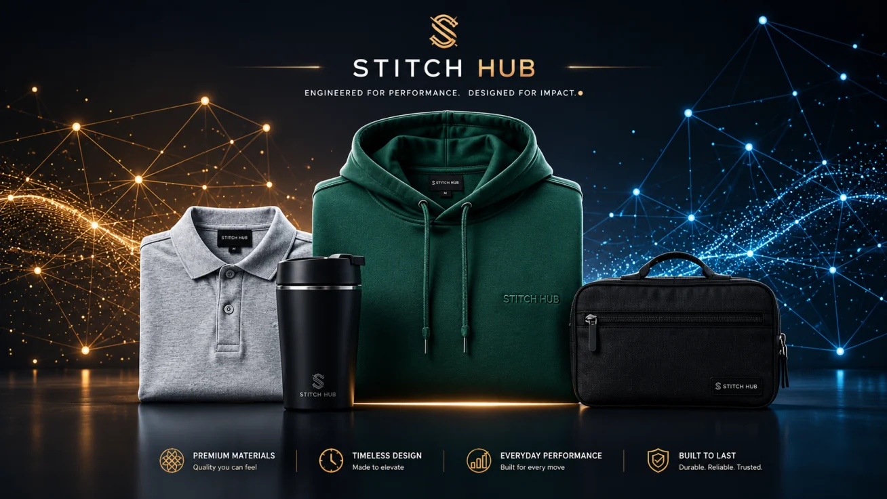
</p>

---

## 🌟 At a Glance: Key Highlights on the Front Page

Here is a quick look at what makes StitchHub different from a generic store or email inbox. Everything is built to help buyers order with confidence while ensuring factories never receive impossible orders:

### 1. Live AI Analyzing & Smart Sourcing Suggestions
Writing a custom merch request is usually frustrating if you don't know factory terminology. On StitchHub, buyers just write what they want in plain, conversational English:

- **Live AI Analyzing**: While you type, StitchHub actively analyzes the order in the background—verifying garment models, checking quantities, and estimating timelines.
- **The Suggestion Box**: Instead of leaving you to guess, StitchHub suggests professional finishing touches on the spot—like adding custom woven neck labels for a brand-ready look, requesting sample mockups for 3D puff embroidery, or adding individual poly-bags with size stickers for easy team distribution.

<p align="center">
  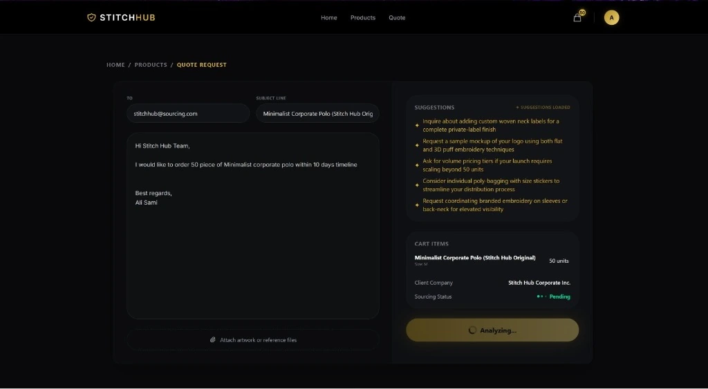
  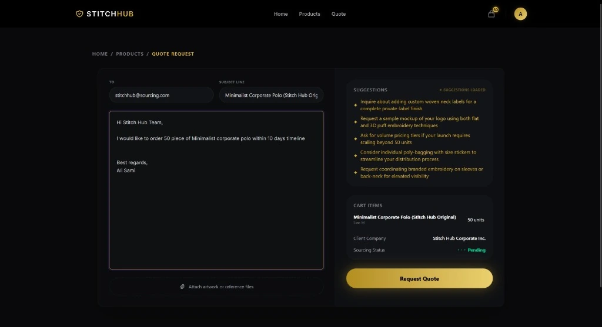
</p>

---

### 2. Smart Admin Escalation: When Rules or Timelines Are Broken
Most automated bots fail because they make promises real factories cannot keep. In real apparel manufacturing, a factory physically cannot produce, embroider, and deliver 50 custom polos in 10 days (StitchHub requires a safe 28-day production window).

Whenever a buyer's request breaks a timeline rule or asks for special customizations outside standard specs:
- **No False Promises**: The system does not pretend everything is fine or make commitments the factory can't deliver.
- **Automatic Escalation**: The thread is instantly flagged as **`ESCALATED TO ADMIN`** and the chat is safely locked so an operations specialist can step in.
- **Partner Workspace**: In the buyer's Partner Workspace, they can see the exact escalation reason, keep track of all messages, and speak directly with a human team member to review rush fees or realistic dates.

<p align="center">
  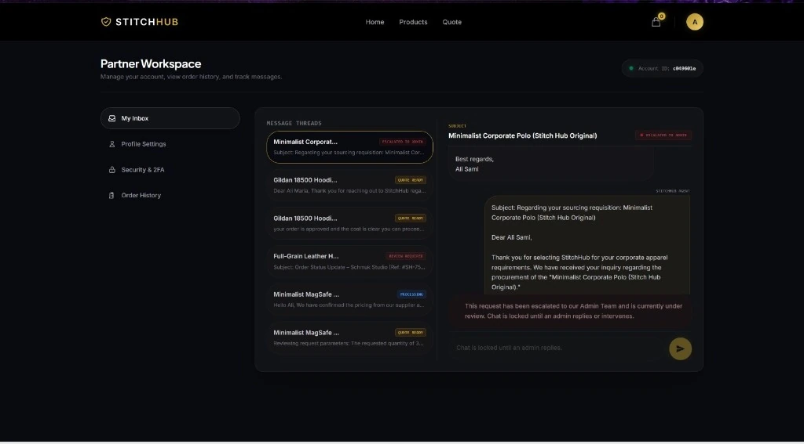
</p>

---

## The Real-World Problem StitchHub Solves

If you have ever been tasked with ordering company hoodies, corporate gifts, or event merchandise for a team, you already know how frustrating the traditional process is:

- **Endless email tag**: You email five different vendors, wait days just to find out if blanks are in stock, and struggle to get a unified price breakdown.
- **Hidden surprises late in the game**: You spend days tweaking a mockup, only for the print shop to tell you: *"Sorry, our minimum order quantity is 200 units, and our turn-around is 8 weeks."*
- **Unrealistic promises that ruin events**: A sales rep promises delivery in 10 days without checking the factory queue. The event arrives, but your boxes don't.
- **Disconnected suppliers and zero margin visibility**: Operations teams juggle messy spreadsheets, guess wholesale costs, and risk losing profit margins on rush jobs.

**StitchHub bridges this gap.** It is a single, connected platform designed for three groups:
1. **Buyers & Brand Teams**: Browse blank apparel, see transparent volume pricing, and get helpful, intelligent advice before submitting quote requests.
2. **Operations & Admins**: Manage warehouse inventory, review profit margins on supplier bids, and step into customer conversations whenever human expertise is needed.
3. **Wholesale Suppliers & Mills**: Receive clean, structured production requests with zero confusing email chains, submit bids in seconds, and fulfill orders with clarity.

---

## How It Works: Complete Operations Tour

### 1. Browse & Configure Products with Real-Time Pricing
Buyers can explore a curated catalog of premium blanks—from heavyweight streetwear hoodies to corporate polos and drinkware. 

- **Live Volume Pricing**: As quantities change, unit prices automatically adjust so buyers can see exact volume discounts upfront.
- **Manufacturing Guardrails**: Minimum order quantities (MOQs) and supported techniques (embroidery, screen printing, woven labels) are built right into the product customizer.

<p align="center">
  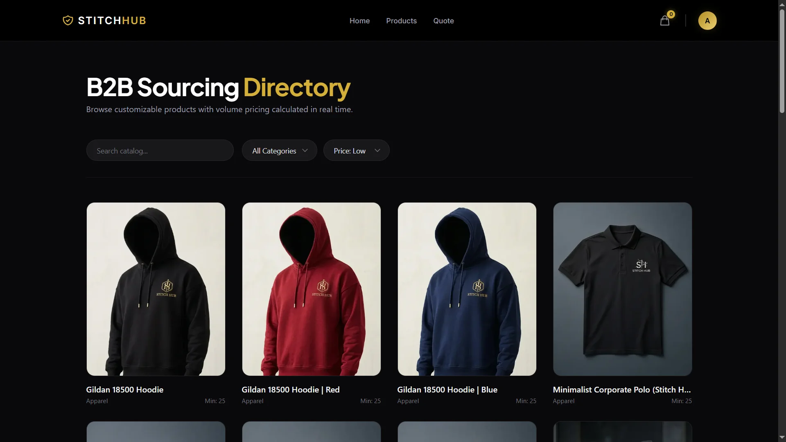
  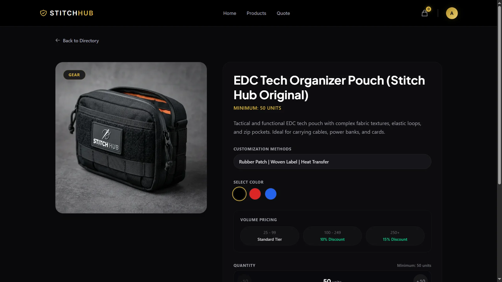
</p>

---

### 2. Operations Command Center: Inventory & Margin Control
Operations teams have complete visibility into the entire fulfillment pipeline:

- **Unified Dashboard**: Monitor incoming quote requests, pipeline conversion rates, and urgent orders that need human attention.
- **Supplier Margin Analysis**: Compare wholesale factory bids directly against client quotes. StitchHub automatically calculates gross profit and margins before any quote is approved.
- **Warehouse Inventory Tracking**: Keep real-time counts of raw garment blanks and set low-stock reorder alerts.

<p align="center">
  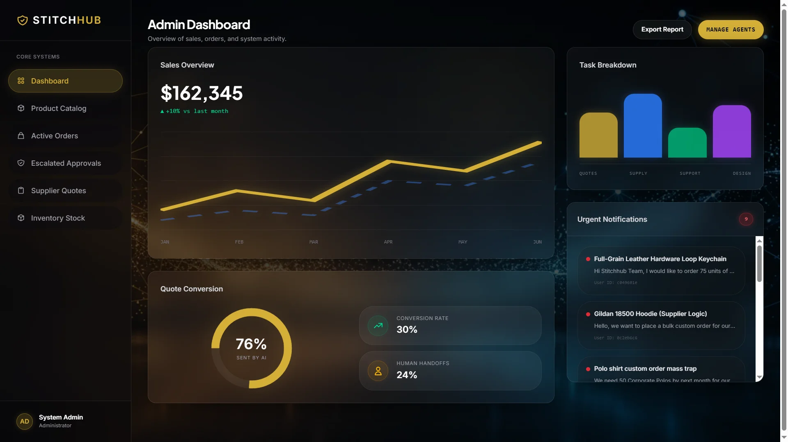
</p>

<p align="center">
  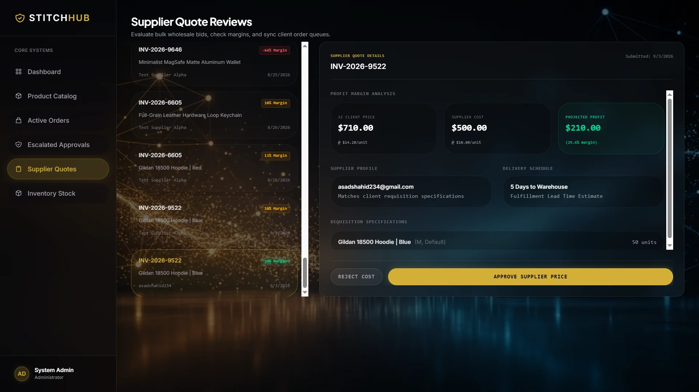
  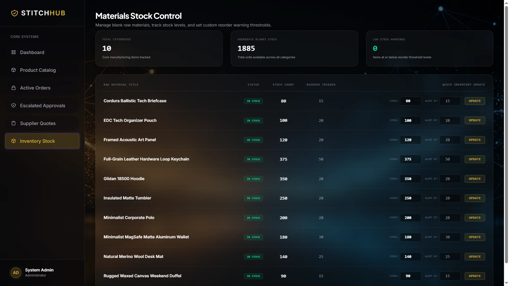
</p>

---

### 3. Supplier Portal: Clean Production Bids
Wholesale garment suppliers and embroidery facilities get their own dedicated workspace:

- **Structured RFQ Feed**: Factory partners view incoming production jobs with exact quantities, color codes, stitch techniques, and target dates.
- **Fast Bidding**: Suppliers enter their wholesale unit price and estimated turnaround in days with a single click.
- **Direct Logistics Channel**: Suppliers can message StitchHub operations directly to clarify fabric weights, thread pantones, or shipping addresses.

<p align="center">
  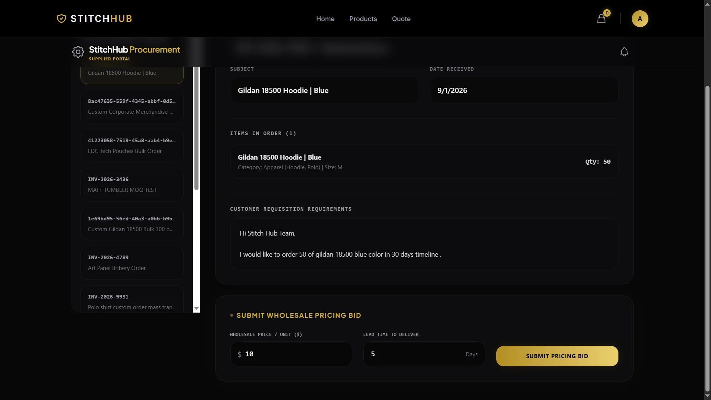
</p>

---

### 4. Production Commitment: 30% Milestone Deposits
Custom manufacturing requires upfront materials and scheduling before blanks are pulled and machines are queued.

- Once a quote is confirmed, buyers can pay a **30% milestone deposit** through a secure checkout powered by Polar.
- The instant payment clears:
  1. Warehouse inventory is reserved and decremented.
  2. A verified purchase order is automatically routed to the selected supplier.
  3. The buyer receives instant confirmation and can follow their order from cutting to delivery.

<p align="center">
  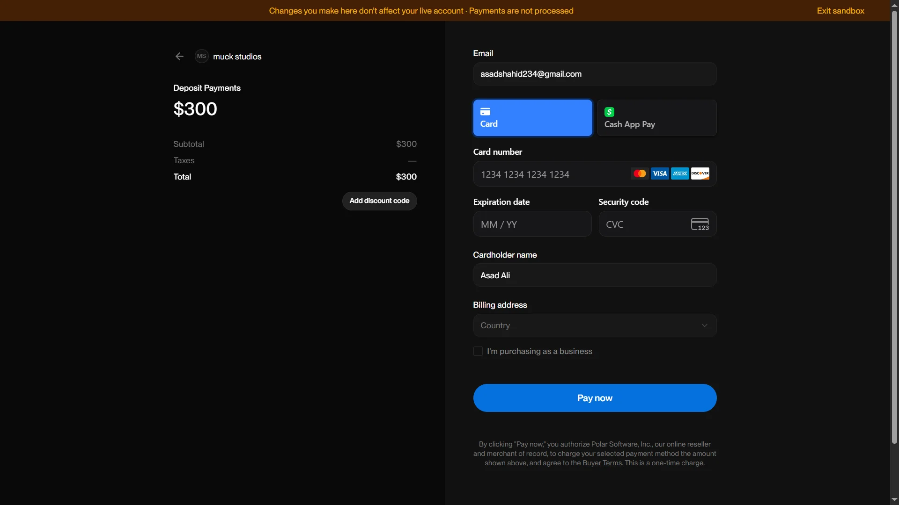
  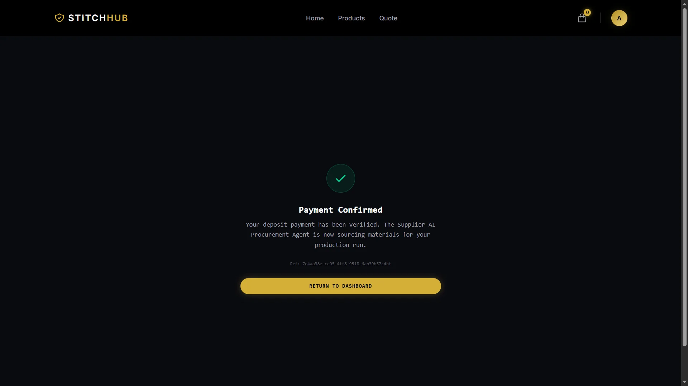
</p>

---

## Technical Architecture

Underneath the user-friendly interface is a modern, reliable full-stack architecture built for real-time commerce and manufacturing operations.

### Requisition Lifecycle Flow

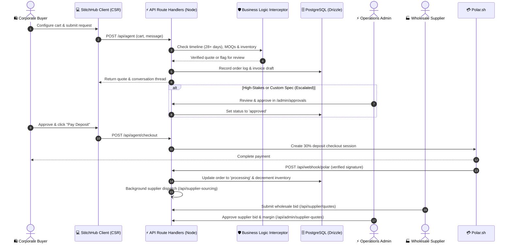

---

### Technology Stack

| Layer | Choice | Why It's Used |
|---|---|---|
| **Framework** | **Next.js 16 (App Router)** | Fast client-side rendering for highly responsive interactive workspaces and secure server routes. |
| **UI Library** | **React 19** | Modern reactive state, hooks, and clean component lifecycles. |
| **Styling** | **Tailwind CSS v4 + Framer Motion** | Luxury dark interface with zinc bases, warm gold accents, and subtle glassmorphic surfaces. |
| **Database** | **PostgreSQL (Supabase)** | Robust relational database with pooled connections and enterprise reliability. |
| **ORM & Migrations** | **Drizzle ORM** | Type-safe SQL schema definitions with automated migration tracking. |
| **Authentication** | **Supabase Auth & SSR** | Secure cookie sessions, role-based routing, and Two-Factor Authentication (MFA). |
| **State Management** | **Zustand 5** | Lightweight client stores for cart state, product filters, and portal interactions. |
| **Server Cache** | **TanStack Query 5** | Optimistic UI updates, automatic data re-fetching, and background cache synchronization. |
| **AI Runtime** | **Local Ollama + Hugging Face / Gemini Fallback** | Multi-tier AI routing: runs locally via Ollama with cloud fallbacks to Hugging Face Spaces and Google Gemini. |
| **Vector Search** | **Pinecone** | Semantic product discovery to match customer requests with catalog blanks. |
| **Payments** | **Polar.sh** | Production milestone deposit checkout with cryptographically verified HMAC webhooks. |
| **Email** | **Brevo** | Automated transactional emails for quotes, admin escalations, and dispatch notices. |

---

### Project Structure

```
Stitchhub/
├── docs/                           # Architecture guides & developer notes
│   ├── QUICKSTART.md               # Local setup & database seeding instructions
│   ├── SUMMARY.md                  # Comprehensive architectural system reference
│   └── polar-integration.md        # Polar payments & webhook verification guide
├── public/
│   ├── image.webp                  # Hero platform preview
│   └── images/
│       ├── app/                    # Web-optimized interface screenshots
│       └── products/               # Wholesale product catalog imagery
├── src/
│   ├── proxy.ts                    # Edge proxy (session verification & auth gates)
│   ├── app/                        # App Router (pages & API route handlers)
│   │   ├── admin/                  # Operations Command Center (dashboard, orders, quotes, stock)
│   │   ├── api/                    # Node.js route handlers (agent, chat, admin, supplier)
│   │   ├── auth/                   # Login, signup, and MFA challenge views
│   │   ├── payment/success/        # Polar deposit success confirmation
│   │   ├── products/               # B2B catalog directory & product detail customizer
│   │   ├── profile/                # Buyer workspace (chat inbox, order history, settings)
│   │   └── supplier/               # Supplier portal (active RFQs, bids, channel messages)
│   ├── components/                 # Modular UI components (admin, chat inbox, catalog)
│   ├── db/                         # Drizzle schema, DB client, and seed scripts
│   ├── hooks/                      # TanStack Query & data-fetching hooks
│   ├── lib/                        # Payment clients, AI routing, and search utilities
│   ├── stores/                     # Zustand state stores
│   └── utils/                      # Pricing calculations, inventory maps, and auth checks
├── drizzle.config.ts               # Drizzle Kit migration configuration
├── next.config.ts                  # Next.js configuration
└── package.json                    # Project configuration and scripts
```

---

## 🚀 Getting Started

### Prerequisites
- **[Bun](https://bun.sh/)** (recommended) or Node.js 20+
- A **[Supabase](https://supabase.com/)** project (for Database URL + Anon Key)
- *(Optional)* **[Ollama](https://ollama.ai/)** running locally with the `stitchhub-v5` model

### 1. Clone & Install
```bash
git clone https://github.com/alisami200092/Stitchhub.git
cd Stitchhub
bun install
```

### 2. Configure Environment
Copy the example environment file:
```bash
cp .env.example .env
```
Add your Supabase connection string, API keys, and optional Polar / Brevo credentials as outlined in `.env.example`.

### 3. Migrate & Seed Database
```bash
# Apply Drizzle migrations to your Supabase PostgreSQL database
bun run db:migrate

# Seed sample wholesale products & warehouse inventory
bun run src/db/seed.ts
bun run src/db/seed_inventory.ts
```

### 4. Run the Development Server
```bash
bun run dev
```
Open [http://localhost:3000](http://localhost:3000) in your browser.

---

## 📚 Further Reading

- 📖 **[Quickstart Guide](docs/QUICKSTART.md)** — Step-by-step developer setup and database verification.
- 🏛️ **[System Architecture Guide](docs/SUMMARY.md)** — Detailed invariants, state machine transitions, and design constraints.
- 💳 **[Polar Integration Guide](docs/polar-integration.md)** — Webhook security, test payloads, and deposit reconciliation.

---

## 📄 License

Proprietary — Built with care by the StitchHub team.
